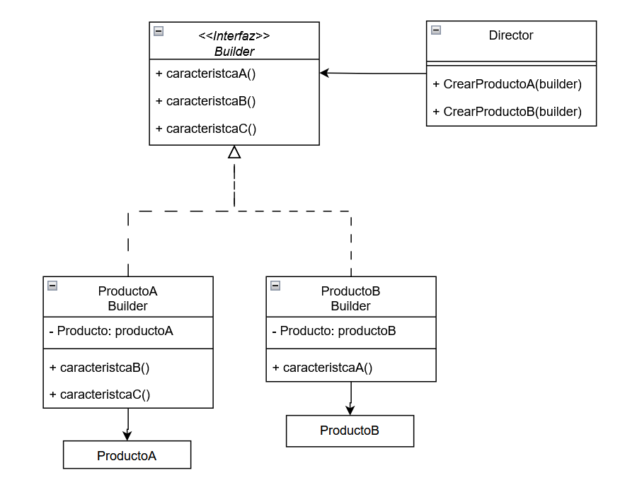

# Patron Builder
## Tipo: Creacional
El **patron builder** nos permite armar objetos que varien en diversos aspectos con la ventaja de usar el mismo codigo de construccion.

Por ejemplo en productos personalizables en una fábrica, donde el Builder configura materiales, tamaños y características según la orden.



```java
interface Builder {

    función caracteristicaA()
    función caracteristicaB()
    función caracteristicaC()
}

clase Director {
    función CrearProductoA(builder) {
        builder.caracteristicaA()
        builder.caracteristicaB()
        builder.caracteristicaC()
        return builder.producto
    }

    función CrearProductoB(builder) {
        builder.caracteristicaA()
        return builder.producto
    }
}

clase ProductoABuilder implementa Builder {
    - Producto: productoA
    
    constructor() {
        this.productoA = new ProductoA()
    }
    
    función caracteristicaB() {
        this.productoA.agregarCaracteristicaB()
    }
    
    función caracteristicaC() {
        this.productoA.agregarCaracteristicaC()
    }
    
    función obtenerProducto() {
        return this.productoA
    }
}

clase ProductoBBuilder implementa Builder {
    - Producto: productoB
    
    constructor() {
        this.productoB = new ProductoB()
    }
    
    función caracteristicaA() {
        this.productoB.agregarCaracteristicaA()
    }
    
    función obtenerProducto() {
        return this.productoB
    }
}


clase ProductoA {
}


clase ProductoB {
}


función principal() {
    director = new Director()
    
    builderA = new ProductoABuilder()
    productoA = director.CrearProductoA(builderA)
    
    builderB = new ProductoBBuilder()
    productoB = director.CrearProductoB(builderB)
}
```
**Patrones que se puedan relacionar:**
- Factory pattern
- Prototype pattern

### Recursos
[Video implementacion Patron builder (3min)](https://www.youtube.com/watch?v=sZYfZrA-gA0)

### Referencias
Gamma, E., Helm, R., Johnson, R., & Vlissides, J. (1994). Design patterns: Elements of reusable object-oriented software. Addison-Wesley.

Shvets, A. (2021). Dive into Design patterns. Refactoring Guru.